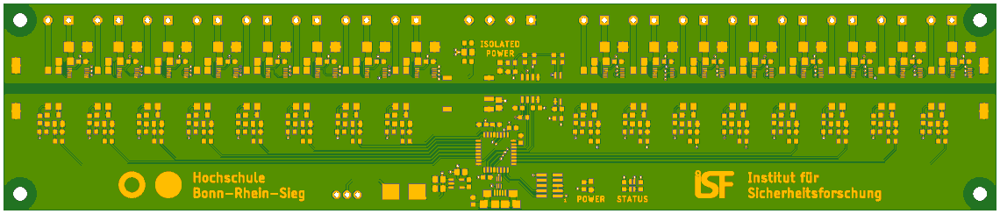
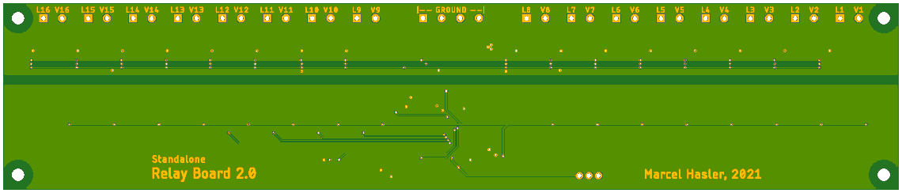
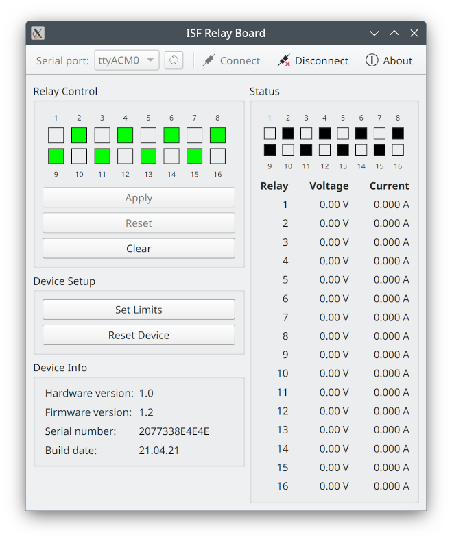

# ISF Relay Board

## Introduction
This repository contains schematics, PCB layout, firmware and software for a circuit board providing 16 software-programmable solid-state relays with individual voltage and current monitoring, every channel capable of switching up to 2 A at 32 V. It's original purpose was to allow control of various valves and pumps for chemical processes from within a LabVIEW program but it may also be useful for other automated control tasks.

## Usage
The device uses a simple text-based protocol to communicate over a USB serial port. See Firmware/Protocol.txt for details. The protocol is also wrapped in a software library exposing both C++ and C interfaces, designed to allow it to be used from any programming language, including LabVIEW.

A Qt-based graphical example program is also provided that can be used to manually test all features of the device.

  

## License
All source code for the software and firmware components, including the LabVIEW code, is licensed under the terms of the GNU General Public License (GPL). All schematics and layout files are licensed under the terms of the Creative Commons Attribution-ShareAlike International Public License (CC BY-SA). See COPYING in the respective subdirectories for details.
